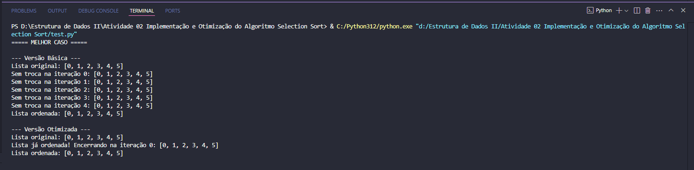
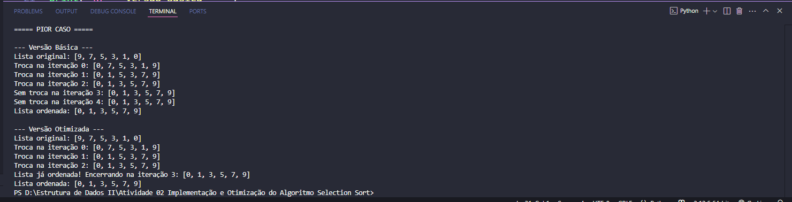

# 📚 Implementação e Otimização do Algoritmo Selection Sort

## 📝 Descrição
Implementação do algoritmo **Selection Sort** nas versões:
- **Básica** (sem otimização);
- **Otimizada** (interrompe caso o restante da lista já esteja ordenado).

O projeto foi realizado para a disciplina **Estrutura de Dados II**, com o objetivo de entender o funcionamento do Selection Sort e aplicar uma otimização simples.

---

## ⚙️ Como executar

```bash
python test.py
```

---

## 🚩 Casos de Teste

### ✅ Melhor Caso
**Lista já ordenada:** `[0, 1, 2, 3, 4, 5]`

- A **versão otimizada** detecta logo na primeira iteração que não há necessidade de continuar e encerra o algoritmo.
- A **versão básica** continua até o final das iterações, mesmo sem realizar trocas.

### 💀 Pior Caso
**Lista em ordem decrescente:** `[9, 7, 5, 3, 1, 0]`

- Ambas as versões precisam realizar múltiplas trocas e percorrem quase todas as iterações, já que os elementos estão fora de ordem.

---

## 🖼️ Prints das execuções

### Melhor Caso:


### Pior Caso:


---

## 🧠 Análise dos resultados

- **Ganho no melhor caso:** O algoritmo otimizado economiza iterações externas ao perceber rapidamente que a lista já está ordenada.
- **Pouca diferença no pior caso:** Como a lista está desordenada, as duas versões acabam realizando a maior parte do trabalho.

### 🔍 Observação:
O ganho real da otimização acontece em **listas já ordenadas** ou **quase ordenadas**, mas não faz tanta diferença quando a lista está muito bagunçada.

---

## ✅ Conclusão
O Selection Sort otimizado apresenta **melhor desempenho** em situações onde a lista já está ordenada, evitando iterações desnecessárias e finalizando o algoritmo mais cedo.

